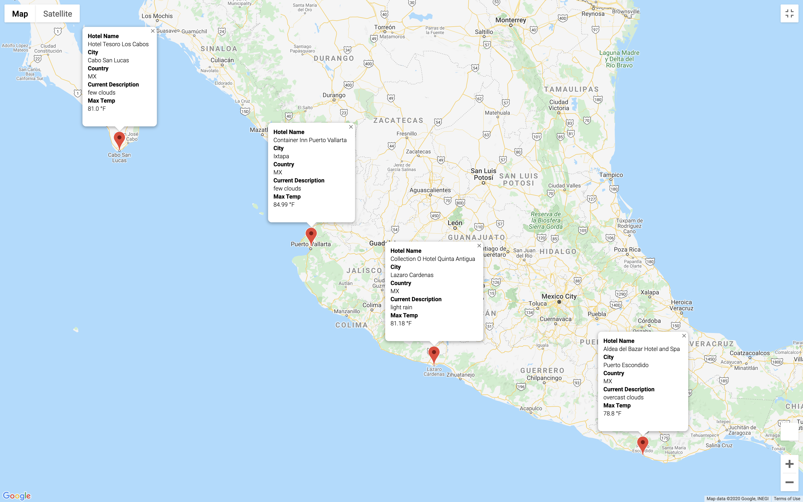

# World_Weather_Analysis
This is an analysis on world weather for travel destinations using API calls to retrieve relevant data and create travel maps.

## Use Case:
Input fields can be created to allow travelers to enter weather preferences to filter retrieved data.  Based on the preferences, potential travel destinations and nearby hotels can be suggested.  From this list of potential travel destinations, the traveler can choose four cities to create a travel itinerary.  Using Google Maps Directions API, a travel route between the four cities can be created for the traveler.  

## Technical Deliverables:

Deliverable 1: Weather_Database
- Generate a set of 2,000 random latitudes and longitudes, retrieve the nearest city, and perform an API call with the OpenWeatherMap. In addition to the city weather data gathered, use API to retrieve the current weather description for each city. Create a new DataFrame containing the updated weather data.

Deliverable 2: Vacation_Search
- Use input statements to retrieve traveler's weather preferences, then use those preferences to identify potential travel destinations and nearby hotels. Create pop-up markers to show those destinations on a marker layer map.

Deliverable 3: Vacation_Itinerary
- Use the Google Directions API to create a travel itinerary that shows the driving route between four cities chosen from the traveler’s possible travel destinations. Create a marker layer map with a pop-up marker for each city on the itinerary with hotel and weather information.

Travel map with Driving Route:

Travel map with Hotel and Weather Information:
